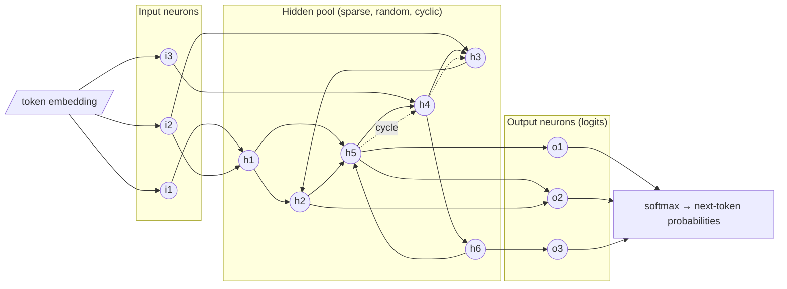
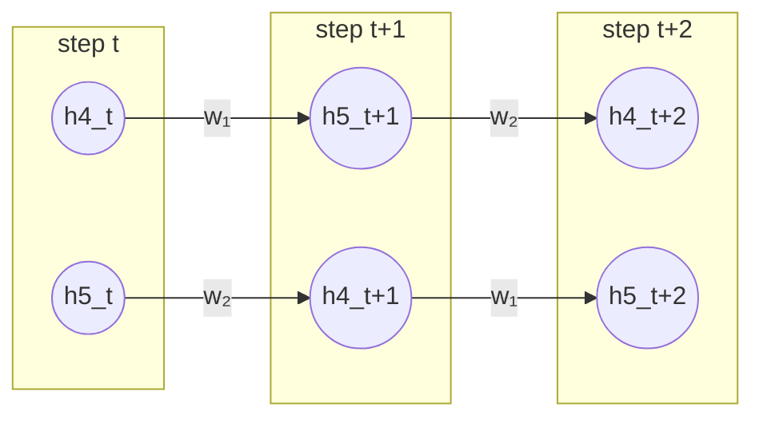
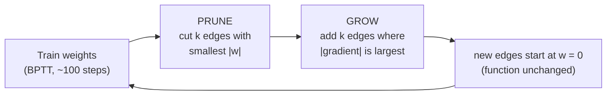

# clemento-ai — A Free-Topology Recurrent Neural Network

An experimental neural network, written in Rust from scratch (no ML framework), that abandons the idea of *layers* entirely.

Instead of stacking `Linear → Activation → Linear → ...`, the network is a **single sparse directed graph** of `N` neurons, wired randomly at initialization, **cycles allowed**. Execution propagates through the graph like a breadth-first search (BFS): input neurons fire first, whatever they activate fires next, and so on. Learning adjusts not only the **weights** of connections, but also the **topology** itself — the network can *grow* new connections and *cut* useless ones during training.

The task used to validate the idea: **character-level next-token prediction** (a tiny language model).

---

## Building & Running

```bash
# 1. Put a plain-text corpus at data/input.txt (e.g. tiny Shakespeare).
mkdir -p data && curl -o data/input.txt \
  https://raw.githubusercontent.com/karpathy/char-rnn/master/data/tinyshakespeare/input.txt

# 2. Inspect the corpus and print the unigram baseline loss (the number to beat).
cargo run --release -- stats --data data/input.txt

# 3. Train (v0, frozen topology). Add --rigl to enable topology learning (v1).
cargo run --release -- train --data data/input.txt --out model.bin \
  --n 4096 --k 32 --window 64 --lr 0.001 --steps 20000

# 4. Generate text from a checkpoint.
cargo run --release -- generate --model model.bin --prompt "ROMEO:" --len 500 --temp 0.8

# Run the test suite (includes the finite-difference gradient check).
cargo test
```

Key flags: `--n` neurons, `--k` out-edges per neuron, `--window` BPTT window,
`--lr` learning rate, `--rigl` enable prune/grow, `--seed` reproducibility,
`--temp` sampling temperature. Execution is multi-threaded via `rayon` and fully
deterministic (same `--seed` ⇒ identical loss); cap threads with
`RAYON_NUM_THREADS=1`.

---

## Table of Contents

1. [Core Idea](#1-core-idea)
2. [Architecture](#2-architecture)
3. [Execution Model (BFS waves = time steps)](#3-execution-model-bfs-waves--time-steps)
4. [Why Cycles Are Not a Problem](#4-why-cycles-are-not-a-problem)
5. [Training: Backpropagation Through Time (BPTT)](#5-training-backpropagation-through-time-bptt)
6. [The Activation Gate & Surrogate Gradients](#6-the-activation-gate--surrogate-gradients)
7. [Topology Learning: Prune & Grow (RigL)](#7-topology-learning-prune--grow-rigl)
8. [Data Structures](#8-data-structures)
9. [Stability: Spectral Radius & Gradient Clipping](#9-stability-spectral-radius--gradient-clipping)
10. [Prior Art — Where Each Piece Comes From](#10-prior-art--where-each-piece-comes-from)
11. [Roadmap](#11-roadmap)
12. [Glossary](#12-glossary)

---

## 1. Core Idea

A classical feed-forward network fixes the computation graph up front: neuron `i` in layer `k` connects to *every* neuron in layer `k+1`, information flows strictly left-to-right, and the architecture never changes after you write it down.

This project asks: **what if none of that is fixed?**

| Property              | Classical MLP / Transformer      | This project                                  |
|-----------------------|----------------------------------|-----------------------------------------------|
| Structure             | Predefined layers                | One flat pool of `N` neurons                   |
| Connectivity          | Dense, layer-to-layer            | Sparse: each neuron has ~`K` random out-edges  |
| Cycles                | Forbidden (except explicit RNNs) | Allowed and encouraged                         |
| Execution order       | Layer by layer                   | BFS wave-front from the input neurons          |
| What training changes | Weights only                     | Weights **and** the connection graph itself    |

The bet is that a network which can rewire itself will discover its own effective architecture — deep paths where depth helps, shortcuts where it doesn't, recurrent loops where memory is needed — instead of inheriting whatever the human designer guessed.

---

## 2. Architecture

The network is one directed graph. Three (overlapping) roles exist within the neuron pool:

- **Input neurons** — receive the embedding of the current token, one token per time step.
- **Hidden neurons** — the bulk of the pool; randomly and sparsely wired, cycles allowed.
- **Output neurons** — their states are read out as logits over the vocabulary (one logit per token).



Note the cycle `h5 → h4 → h3 → h2 → h5`: perfectly legal here. This is what gives the network **memory** — activity can circulate and persist across time steps, which is how it can remember earlier tokens of a phrase.

### Initialization

- Each neuron gets `K` outgoing connections (e.g. `K = 32`) to uniformly random targets → the graph is **sparse**: `N × K` edges instead of `N²`.
- Weights are drawn randomly, then globally rescaled so the graph's **spectral radius** is ≈ 0.9–1.0 (see [§9](#9-stability-spectral-radius--gradient-clipping) — this keeps signals from exploding or dying).
- Rather than dedicating one raw input/output neuron per vocabulary token (which couples graph size to vocabulary size), a small dense **embedding matrix** maps `token → input neuron states`, and a dense **readout matrix** maps `output neuron states → logits`. The interesting part — the graph — stays vocabulary-agnostic.

---

## 3. Execution Model (BFS Waves = Time Steps)

Execution is **event-driven**, like a wave spreading through the graph:

1. **Inject**: write the current token's embedding into the input neurons. They form the initial *frontier* (the set of active neurons).
2. **Propagate**: every active neuron sends `state × weight` along each of its out-edges. Contributions arriving at the same target neuron are summed.
3. **Activate**: each neuron that received input applies a nonlinearity (`tanh`) and an *activation gate*. Neurons whose gate opens form the **next frontier**.
4. **Read out**: the output neurons' states are mapped to logits → a prediction for the next token, **every step**.
5. **Repeat** from 2. On the next step, the *next* token of the phrase is injected (one token per step, as in any recurrent model).

```
 step t=0            step t=1            step t=2            step t=3
 (inject "h")        (inject "e")        (inject "l")        (inject "l")

 frontier:           frontier:           frontier:           frontier:
 ┌────────┐          ┌────────┐          ┌────────┐          ┌────────┐
 │ inputs │──wave──▶ │ inputs │──wave──▶ │ inputs │──wave──▶ │ inputs │
 └────────┘          │ + h1,h3│          │ + h2,h4│          │ + h5,h2│
                     └────────┘          │   h6   │          │ (loop!)│
                                         └────────┘          └────────┘
     │                   │                   │                   │
     ▼                   ▼                   ▼                   ▼
  predict "e"        predict "l"         predict "l"         predict "o"
  (logits)           (logits)            (logits)            (logits)
```

Key design decision: **one BFS wave = one synchronous time step**. All active neurons fire "simultaneously" within a step, and their effects land at the *start of the next step*. This sounds like a small bookkeeping detail, but it is what makes the whole thing trainable — see the next section.

Because only frontier neurons compute anything, cost per step is proportional to *active* neurons × `K`, not to the full network. A quiet network is a cheap network.

---

## 4. Why Cycles Are Not a Problem

The scary question with a cyclic graph is: *"if h5 feeds h4 and h4 (indirectly) feeds h5, when do we stop computing?"*

Answer: we never compute "around" a cycle within a single step. An edge that points "backward" simply delivers its signal **on the next time step**. Unrolling execution over time turns the cyclic graph into a plain **DAG** (directed acyclic graph):



The cycle `h4 ⇄ h5` in the *structural* graph becomes a zig-zag of forward-only edges in the *unrolled* graph. Every arrow points strictly from step `t` to step `t+1` — no loops, no infinite recursion, and standard backpropagation applies. This is exactly how recurrent neural networks (RNNs) have always handled recurrence; we're just applying it to an arbitrary graph instead of a hand-designed recurrent cell.

---

## 5. Training: Backpropagation Through Time (BPTT)

**BPTT** (*Backpropagation Through Time*) is the standard algorithm for training any network whose computation spans multiple time steps. It's ordinary backpropagation, applied to the **unrolled** graph from §4:

- **Backpropagation** (recap): after the forward pass computes a loss, walk the computation graph *backwards* applying the chain rule, computing for every weight *"how much would the loss change if this weight nudged up?"* — its **gradient** — then move each weight a small step against its gradient.
- **"Through time"**: since the unrolled graph spans `T` steps, gradients flow backwards *across steps* too. If the network mispredicts at step 10 because of something a neuron did at step 3, BPTT carries blame backwards through steps 9, 8, … 4, 3 and adjusts the weights that caused it. This is how the network learns *long-range* behavior — remembering a character seen several tokens ago.

Concretely, one training iteration:

```
FORWARD  (record everything)
  for t in 0..T:
      inject token[t]
      run one BFS wave                    // §3
      store: frontier set, pre-activations, gate decisions
      loss[t] = cross_entropy(logits[t], token[t+1])

BACKWARD (walk the tape in reverse)
  for t in T-1..=0:
      backprop loss[t] into readout, then into neuron states at step t
      for each edge (i → j) active at step t:
          grad_w[i→j] += state_i[t] * delta_j[t+1]
          delta_i[t]  += w[i→j]     * delta_j[t+1]   // blame flows upstream & backwards in time

UPDATE
  clip gradients (§9), apply SGD/Adam step
```

Two deliberate choices that make credit assignment easier:

- **A loss at every step** (predict the next token continuously), not just one loss at the end of the phrase. Gradients don't have to survive a trek across the entire sequence to reach early weights.
- **Truncated BPTT**: for long texts, unroll only a window of e.g. 64 steps and carry the neuron states across windows without gradients. Memory stays bounded.

No autograd framework is needed: because we control the forward pass, the backward pass is a handful of lines of explicit chain rule per edge.

---

## 6. The Activation Gate & Surrogate Gradients

The BFS semantics need a discrete decision: *"did neuron j activate (join the next frontier) or not?"* A hard threshold —

```
fires(j) = |pre_activation(j)| > θ
```

— is a step function, and a step function has **gradient zero everywhere** (and undefined at the jump). If we backpropagate through it literally, no learning signal ever crosses the gate: a neuron that currently stays silent can *never* learn that it should have fired. Whole regions of the graph would be permanently dark.

The fix is a **surrogate gradient** — a trick from spiking-neural-network research:

- **Forward pass**: use the true hard threshold. Execution stays sparse and event-driven, exactly as designed.
- **Backward pass**: *pretend* the threshold was a smooth function (a steep sigmoid) and use *its* gradient instead.

```
 forward (what runs)              backward (what we pretend ran)

 gate ▲                           gate ▲
   1 ─┤      ┌────────              1 ─┤        ,────────
      │      │                        │      ,─´
      │      │                        │    ,─´   ← nonzero slope:
   0 ─┤──────┘                     0 ─┤ ──´        gradients pass!
      └──────┬────────▶ pre           └──────┬────────▶ pre
             θ                               θ
```

The forward computation is slightly "lied about" during the backward pass, but the lie is local and well-behaved, and it's the standard, empirically proven way to train networks with discrete firing decisions. (The same idea appears elsewhere as the *straight-through estimator*.)

---

## 7. Topology Learning: Prune & Grow (RigL)

Weights have gradients; **the existence of an edge does not**. "Should there be a connection from h2 to h9?" is a discrete, combinatorial question — you can't differentiate through it. So topology is learned with a scheduled heuristic instead of gradient descent, following **RigL** (*"Rigging the Lottery"*, Evci et al. 2020, Google Brain):

Every `ΔT` optimizer steps (e.g. every 100), while keeping the **total edge count constant**:

1. **Prune** — for each neuron, drop the `k` outgoing edges with the smallest `|weight|`. A near-zero weight means the network has already decided this connection carries no useful signal.
2. **Grow** — create `k` new outgoing edges toward the candidate targets with the **largest gradient magnitude** `|∂loss/∂w|` — i.e. the connections that *don't exist yet* but that backprop is "asking for" most loudly. New edges start at weight 0, so growth never disturbs the current function; the edge earns its weight through subsequent training.
3. **Decay the churn** — `k` shrinks over training (cosine schedule), so the graph explores wildly early on and settles into a stable architecture late.



Why this beats the obvious alternatives:

- vs. **random growth** (SET algorithm): growing where the gradient is loudest targets connections that provably reduce the loss *right now*, and converges to better graphs.
- vs. **evolving topology** (NEAT): no population of networks, no fitness evaluations — topology search rides along with ordinary gradient training at almost no extra cost.

One practical note: the "which absent edge has the largest gradient" question is over `N² − N·K` candidates. Computing it exactly is a dense operation, so we estimate it on a **random sample of candidate edges** per neuron — good enough in practice and keeps the update cheap.

This is the mechanism that delivers the original goal: the network doesn't just tune weights, it **rewires itself** — cutting dead connections and creating new ones where learning pressure demands them.

---

## 8. Data Structures

Everything lives in flat arrays; no per-neuron heap objects, no pointers chasing.

```rust
struct Network {
    // ---- topology: CSR (Compressed Sparse Row) adjacency ----
    row_ptr: Vec<u32>,   // len N+1: out-edges of neuron i live in idx row_ptr[i]..row_ptr[i+1]
    col_idx: Vec<u32>,   // len E:   target neuron of each edge
    weights: Vec<f32>,   // len E:   weight of each edge

    // ---- state (double-buffered per BFS step) ----
    state: Vec<f32>,       // len N: current activations
    next_state: Vec<f32>,  // len N: accumulator for the next wave
    frontier: Vec<u32>,    // indices of currently-active neurons

    // ---- token interface ----
    embed:   Vec<f32>,   // V × n_in  : token → input neuron states
    readout: Vec<f32>,   // n_out × V : output neuron states → logits
}
```

**CSR** (*Compressed Sparse Row*) stores a sparse matrix as three flat arrays. Iterating a neuron's out-edges is a contiguous slice scan — ideal for the hot propagation loop and very cache-friendly. The trade-off is that CSR is awkward to mutate in place, which is fine: topology only changes at RigL events (every ~100 steps), and we simply **rebuild** the CSR arrays then.

To parallelize without write collisions we also keep a **transpose (in-edge) CSR** (`in_row_ptr`, `in_edge`) and an `edge_src` array (the source neuron of each edge). The forward pass then *gathers* — each target neuron sums its own in-edges independently, so it parallelizes across targets with `rayon` and gives bit-identical results regardless of thread count. The backward pass parallelizes over sources (disjoint out-edge ranges) and over edges (each written once per step), so it's race-free and deterministic too. The transpose is rebuilt only when topology changes, never per step; weights are read live and never duplicated. `rand` handles initialization and growth sampling. `rand` and `rayon` are the only dependencies.

The forward "tape" recorded for BPTT is `T` snapshots of `(frontier, pre_activations)` — for 5k neurons and 64 steps, a few MB.

---

## 9. Stability: Spectral Radius & Gradient Clipping

A random recurrent graph is a feedback system, and feedback systems either explode or die unless tuned. Two guards:

**Spectral radius scaling (at init).** The spectral radius of the weight matrix — its largest eigenvalue magnitude, call it `ρ` — governs what happens to circulating activity, step after step:

```
 ρ > 1                 ρ ≈ 0.95 (target)        ρ ≪ 1
 activity ▲            activity ▲               activity ▲
          │    ╱               │ ─╲_                     │╲
          │   ╱                │    ─╲__                 │ ╲
          │  ╱                 │        ────___          │  ╲__
          │ ╱                  │                         │     ────
          └────▶ steps         └────────▶ steps          └────▶ steps
   explodes → NaN        fades slowly → usable      dies instantly →
                         memory over many steps     no memory at all
```

After random init we estimate `ρ` (power iteration — repeatedly multiply a random vector by the sparse matrix and measure its growth) and rescale all weights by `target / ρ`. This is the central trick of Echo State Networks and it is what makes a *random* recurrent graph usable at all.

**Gradient clipping (during training).** BPTT multiplies gradients through many steps; through recurrent loops they can compound explosively. Before every optimizer update, if the global gradient norm exceeds a cap (e.g. 1.0), rescale it down. Cheap, standard, essential.

---

## 10. Prior Art — Where Each Piece Comes From

None of the ingredients is invented here; the (hopefully interesting) part is the combination.

| Piece of this project | Field / technique it comes from |
|---|---|
| Random sparse recurrent graph, spectral-radius init | **Echo State Networks / reservoir computing** (Jaeger 2001) — but ESNs freeze the graph; we train it |
| Event-driven "only active neurons compute" execution | **Spiking Neural Networks** |
| Training through the hard fire/don't-fire decision | **Surrogate gradients** (SNN literature) / straight-through estimator |
| Backprop across time steps of an unrolled cyclic graph | **BPTT**, standard RNN training |
| Learning topology by cutting & growing connections | **Dynamic sparse training**: SET (Mocanu 2018), **RigL** (Evci 2020) |
| Topology evolution as an idea | **NEAT** (Stanley 2002) — the goal, achieved here by cheaper means |

Honest expectation-setting: on language modeling, this will not beat a transformer of equal parameter count — sequential recurrent credit assignment over long contexts is precisely the weakness attention was invented to fix. The purpose of this project is to explore **learned topology** and free-form graph computation, with a tiny language model as the measurable testbed.

---

## 11. Roadmap

- **v0 — weights-only training.** ✅ *Done.* ~2–5k neurons, `K ≈ 32`, fixed random topology (spectral-radius scaled), hard-gate forward + surrogate-gradient backward, truncated BPTT, Adam, char-level corpus. Loss drops well below the unigram baseline and keeps falling; a finite-difference gradient check validates the backward pass.
- **v1 — RigL prune/grow.** ✅ *Done.* Scheduled topology updates with a constant edge budget, gradient-guided growth over sampled candidates, cosine-decayed churn. Enable with `--rigl`.
- **Speed.** ✅ *Done.* `rayon`-parallel gather forward + parallel backward, deterministic across thread counts (see §8).
- **v2 — analysis (next).** Visualize the learned graph: does structure emerge (hubs, effective layers, memory loops)? Ablations: gradient-guided growth vs. random growth (SET); gate-threshold sweep; v1-vs-v0 at equal parameter count.
- **v3 — scale.** Larger `N`, longer contexts, word-level tokens, activity-sparsity tuning (raise `θ` to keep the active fraction low so scatter beats gather at scale).

---

## 12. Glossary

- **BPTT (Backpropagation Through Time)** — training a network that runs over multiple time steps by "unrolling" it (one copy of the graph per step, recurrent edges pointing from step *t* to *t+1*) and applying ordinary backpropagation to that unrolled graph. Gradients flow backwards through time, letting weight updates account for consequences that only show up steps later. *Truncated* BPTT unrolls only a fixed window to bound memory.
- **RigL ("Rigging the Lottery", Evci et al. 2020)** — a dynamic sparse-training method: periodically **prune** the edges with the smallest weight magnitudes and **grow** the same number of new edges where the loss gradient (w.r.t. currently-nonexistent connections) is largest, keeping total sparsity constant. Lets a sparse network *find* its own connectivity during training instead of fixing it up front.
- **SET (Sparse Evolutionary Training)** — RigL's predecessor: same prune step, but grows new edges *randomly* instead of gradient-guided.
- **NEAT (NeuroEvolution of Augmenting Topologies)** — evolves both weights and topology with a genetic algorithm over a population of networks. Achieves free-form topology learning, but without gradients and at much higher compute cost.
- **Surrogate gradient** — using the true discrete function (hard threshold) on the forward pass but substituting a smooth approximation's derivative on the backward pass, so gradient descent can train through non-differentiable decisions. Closely related to the **straight-through estimator**.
- **Echo State Network (ESN) / reservoir computing** — an RNN whose recurrent part is a large *random, fixed* sparse graph (the "reservoir"); only a linear readout is trained. Source of the spectral-radius initialization used here.
- **Spiking Neural Network (SNN)** — biologically-inspired networks where neurons emit discrete events ("spikes") only when their potential crosses a threshold; computation is event-driven and sparse, like this project's BFS waves.
- **Spectral radius (ρ)** — the largest absolute eigenvalue of the weight matrix; controls whether activity circulating through recurrent loops amplifies (ρ > 1, explodes) or decays (ρ < 1). Target ≈ 0.9–1.0 for long-but-stable memory.
- **CSR (Compressed Sparse Row)** — a sparse-matrix layout using three flat arrays (`row_ptr`, `col_idx`, `values`); makes iterating one node's edges a contiguous, cache-friendly slice.
- **Logits** — the raw, unnormalized scores a network outputs per class (here, per vocabulary token) before softmax turns them into probabilities.
- **Cross-entropy loss** — the standard loss for next-token prediction: the negative log-probability the model assigned to the token that actually came next.
- **Gradient clipping** — rescaling the gradient vector when its norm exceeds a cap, preventing the exploding-gradient failures common in recurrent training.
- **Frontier** — BFS terminology: the set of nodes active in the current wave; here, the set of neurons that fired this time step.
